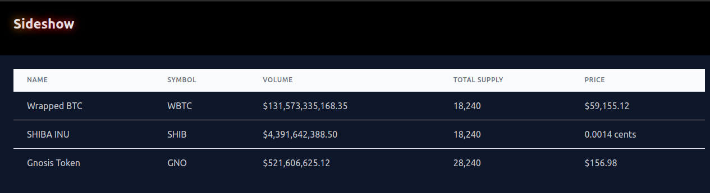

# sideshow - a crypto price aggregator

> Copyright BoundCorp 2024

## Introduction
Hi, I'm Leeward, thanks for stopping by!

This project is my interview homework for Rodeo. It's python/django and a new framework
called [`mountaineer`](https://github.com/piercefreeman/mountaineer), which is a FastAPI handler
that provides SSR tsx rendering via rust bindings.

As an earnest disclaimer, I chose to use Mountaineer because it was an opportunity to put mountaineer to the test, as I've been interested in the project for some time, and haven't evaluated a project of this size yet. This caused some unexpected issues, which I mostly managed to work through (RIP SSE), but I was able to complete all the requirements of the homework in about 4 hours (1h50m for initial requirements, ~1h for extras, ~1h for docs and devops).

- [x] Pull latest prices from thegraph api [tokens/graphapi.py](sideshow/apps/tokens/graphapi.py)
- [x] Store the data in a postgres database [tokens/models.py](sideshow/apps/tokens/models.py)
- [x] Long running process for updating token prices [scripts/token_data.py](sideshow/scripts/token_data.py) and [infra/dev/compose.yml](infra/dev/compose.yml)
- [x] Single command to start everything `make dev` or `dcleanup` [Makefile](Makefile)
- [x] FastAPI endpoint for pulling token prices [pages/index/controller.py](sideshow/views/src/pages/index/controller.py)
  ```
  curl -X POST 'http://localhost:8833/internal/api/home_controller/get_chart_data?token_address_or_name=WBTC&time_unit_in_hours=4'
  ```
- [x] Create a superuser (`djmanage createsuperuser`) and browse pricing data in the admin UI at `http://localhost:8833/mgmt` [tokens/admin.py](sideshow/apps/tokens/admin.py)
- [x] Tailwind frontend for viewing the tokens and latest prices [pages/index/controller.py](sideshow/views/src/pages/index/controller.py)

- [ ] SSE realtime frontend updates, I had some mountaineer errors that I couldn't resolve in time, possibly related to docker port mapping?
- [ ] Frontend Charts - One of my favorite things about mountaineer is how easy it is to add SSR charts and stream data into them, but I spent more time than I wanted on SSE, and I gave up on this

* **A Note on the Chart Data API:** It's of a slightly incorrect shape. Instead of a 3D array, the top level is a dictionary object with keys: `open`, `close`, `high`, `low`, and `priceUSD`. The values are otherwise to spec; internally, the get_chart_data method returns the specified 3D array shape, but mountaineer wound up getting in the way of serializing this cleanly. I could have added a redundant django-rest-framework or FastAPI endpoint, not using mountaineer, just to have a fully conformant API method, but I felt it violated the spirit of the requirements - I want to provide clean code and clear communication, so leaving a note here is a better option.


## Running the Dev Environment

We've setup a few quality-of-life utilities in the `bin/` folder to make running the dev environment easier.

For convenience, you can find aliases for common tasks in the `Makefile`.

New here? Just cloned the project? This will get you started:
```
direnv allow && make dev
```

### Direnv and .envrc

It is highly recommended to install the [direnv](https://direnv.net/) utility. This will automatically load the
environment variables in the `.envrc` file when you `cd` into the project directory.

### Installing Dependencies

`make deps` will:

+ Creates a new virtualenv (probably in `./.venv/`)
+ Installs the python dependencies from `pyproject.toml` 
+ (in `sideshow/views/`) Installs the frontend npm dependencies from `package.json` using `yarn`
+ Builds development docker containers for the backend
+ Launches the docker containers

```bash
make deps
```

## Running the project

If you just ran `make deps` above, it should have started the project for you.

If not, you can run `dcleanup` to cleanly start the project (or a specific container) at any time.
`dcleanup` is a helper for running `docker compose kill`, `docker compose rm -f`, and `docker compose up -d` in order,
followed by `docker compose logs -f` (which can safely be terminated without stopping the containers).

Now you can run `dc ps` to see the running containers:

```bash
$ dc ps

NAME                 SERVICE             CREATED             STATUS              PORTS
sideshow-backend-1   backend             3 seconds ago       Up 1 second         8833/tcp
sideshow-psql-1      psql                3 seconds ago       Up 2 seconds        5432/tcp
```

Great! Now just run `bin/browser` to open the application in your browser
(or click here http://localhost:8833)

### Why Docker and virtualenv Together?

It may seem redundant to use both Docker devcontainers and local virtualenv, but there are a few reasons why we do this:

+ For many developer commands, starting the application with a local `virtualenv` is much faster than using the devcontainer
+ However the local `virtualenv` is not able to connect to `psql` or `redis` docker containers (without some extra setup,
  not performed here)
+ The devcontainer is able to connect to the `psql` and `redis` containers, but is slower to start
+ Many external commands (such as `flake8` and `manage.py test`) can be run from the local `virtualenv` without starting the
  devcontainer
+ The entire git precommit hook must be run from the local `virtualenv` (because `docker compose exec` does not work in a
  git hook due to TTY issues)

### .envrc Variables Explained

This project uses .envrc to load the virtual environment and expose several key variables, including the following
defaults:

```
export CI_PROJECT_NAME=sideshow # Used to name the docker image and docker-compose application
export CI_REGISTRY_IMAGE=gitlab.com/boundcorp/sideshow # Docker registry for helm deployments
export PYTHON_VERSION=3.10 # 
export DEVELOP_BACKEND_PORT=8833 # Port for the backend to run on - not exposed by default, check compose/dev.yml
export DEVELOP_INGRESS_PORT=3388 # USE THIS PORT - Caddy ingress port (proxies traffic to minio and backend)
export KUBE_CLUSTER=sideshow # Change this to whatever your kubectl cluster context is named
export SECRET_KEY=123_development_key # You can leave this as unsafe garbage in development, but secure it for production
export ROLE=dev # Used to determine which docker-compose file to use, check compose/dev.yml and compose/prod.yml
export PATH=$(pwd)/bin:$PATH # Add the bin folder to the path so we can use the utilities by name
export PROJECT_KUBECONFIG=$HOME/.kube/clusters/$KUBE_CLUSTER # used by bin/kx_gke to set the kubeconfig context
```

## Cookiecutter

This project was built using
the [boundcorp/cookiecutter-django-mountaineer](https://github.com/boundcorp/cookiecutter-django-mountaineer) template.
